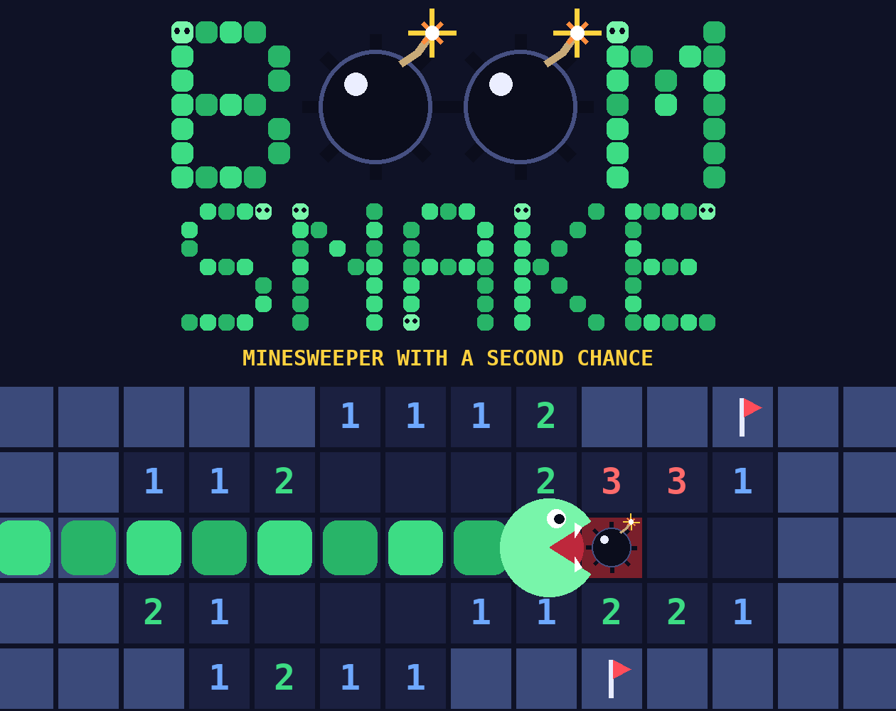

# Boom Snake



**Minesweeper with a second chance.** Hit a bomb and you get tunneled into a game of Snake. Eat enough apples and you earn your way back to the exact board you left. Run out of redemptions and it's over.

AME 294: Games and AI, Portfolio Game 2 (Vibe-Coded Browser Game)
Student: David Benjo

- **Play on Itch.io:** https://dbenjo-glitch.itch.io/boom-snake
- **Play on GitHub Pages:** https://dbenjo-glitch.github.io/github-game-ame-294/
- **Prompt log:** [PROMPT_LOG.md](PROMPT_LOG.md)

## How to play

1. Click or press Space on the start screen.
2. Reveal tiles. Numbers show how many mines touch that tile. Your first tap is always safe.
3. Flag tiles you think are mines.
4. Clear every safe tile to win.

**If you hit a bomb**, you are sent to Snake:

| Bomb | Redemption |
|---|---|
| 1st | Eat 10 apples |
| 2nd | Eat 20 apples |
| 3rd | Eat 30 apples |
| 4th | No redemption. Game over. |

Reach the target and a hole opens in the wall. Your snake escapes through it and you are back on your Minesweeper board. Crash into a wall or yourself and the run ends.

### Difficulty

Pick a mode on the start screen. Harder modes mean a bigger board, denser mines and a faster snake.

| Mode | Board | Mines | Snake |
|---|---|---|---|
| Easy | 8x8 | 8 | Slow |
| Medium | 8x8 | 10 | Normal |
| Hard | 10x10 | 18 | Fast |
| Ultra Hard | 12x12 | 30 | Very fast |

In every mode the snake gets 5% faster for every 5 seconds you spend in Snake, so stalling costs you.

### Controls

| | Desktop | Mobile |
|---|---|---|
| Reveal | Left-click | Tap |
| Flag | Right-click, or toggle FLAG MODE (F) | FLAG MODE button, then tap |
| Steer the snake | Arrow keys or WASD | Swipe, or the on-screen D-pad |

### Pause, sound and leaderboard

- **PAUSE** (or P / Esc) works in both Minesweeper and Snake. The pause menu has Resume, the two sound sliders, and Quit to Menu.
- **SOUND** on the start screen opens the same two sliders, one for music and one for game sounds. Your levels are saved.
- **NAME** on the start screen sets the name shown on the leaderboard.
- **LEADERBOARD** shows the five fastest wins for each difficulty. It is saved in your own browser, so it is a personal best board, not a shared online one.

### Coins and snake colors

A win pays 4 coins, minus 1 for each redemption you used. Spend coins on the start screen to unlock snake colors (4, 10 and 20 coins). Coins are saved in your browser.

## The core loop: Reward, Damage, End

| | In the game | Sound |
|---|---|---|
| **Reward** | +10 points per safe tile, +5 per apple, escaping Snake, coins for a win | `redeem.mp3` |
| **Damage** | Hitting a bomb costs a redemption and tunnels you into Snake. Crashing in Snake ends the run | `boom.mp3`, `thump.mp3` |
| **End** | Win: board cleared, time shown, a snake eats every mine. Loss: fourth bomb or a Snake crash | `victory.mp3`, `womp.mp3` |

The loss sound is one file reused: Snake death is `thump` then `womp`, and the fourth bomb is `boom` then `womp`. A looping arcade chiptune track (`music.ogg`) plays quietly underneath.

## Run it

No build step and no install.

- **Online:** open the play link above.
- **Locally:** download the repo and open `index.html`, or serve the folder (`python3 -m http.server`) and visit `http://localhost:8000`.

Audio starts after the first click or key press, as browsers require.

## Tech stack

- **Phaser 3.90.0**, vendored in `lib/` so the game has no network dependencies
- Vanilla JavaScript, plain script tags, no bundler
- Web Audio through Phaser's sound manager (HTML5 audio fallback only when opened from disk)
- `localStorage` for coins and unlocked colors
- All visuals drawn in code. There are no image files.

```
index.html                  entry point
lib/phaser.min.js           Phaser 3 (MIT)
src/config.js               every tunable number: difficulty modes, apple targets, speed-up, prices, volumes
src/state.js                shared run state, so the board survives the trip into Snake
src/board.js                Minesweeper rules, no drawing
src/audio.js                loading, playing and chaining the sound effects
src/ui.js                   shared text, button and icon helpers
src/scenes/BootScene.js     loads audio and saved coins
src/scenes/StartScene.js    title, rules, color shop, audio unlock
src/scenes/MinesweeperScene.js
src/scenes/SnakeScene.js
src/scenes/EndScene.js      win and loss screens
src/main.js                 Phaser config and scene list
assets/audio/               the five sound effects and the background loop
```

## References and inspiration

**Gameplay references**

- Google's browser versions of Minesweeper and Snake. Both are simple, web-based and instantly readable, which made them the right pieces to combine.
- The twist is the student's own: instead of a bomb ending the game, it sends you somewhere else to earn your way back, and the price goes up each time (10, 20, then 30 apples).

**Visual moodboard**

- Dark arcade cabinet palette: deep navy background, bright green snake, yellow highlights, red for danger.
- Classic Minesweeper number colors, brightened for a dark board.
- Chunky code-drawn shapes instead of sprites, so everything reads clearly on a phone.

**Sonic moodboard and target acoustic style**

- Overall: retro arcade and chiptune, short and punchy, so effects never talk over each other.
- Music: a tense 140 BPM chiptune loop, like a boss stage, kept quiet under the effects.
- Damage: a small land mine explosion with a crackle, and a dull heavy bump for the snake hitting a wall.
- Loss: a playful, sad saxophone game over that fizzles out. Funny, not punishing.
- Reward: an ascending jazz synth "bump bump bump" with a snake sound, for escaping back to the board.
- Win: an eager guitar synth jingle ending in a snake slither, timed to the snake eating the mines on the win screen.

## AI tools used

| Purpose | Tool |
|---|---|
| Code, architecture, testing and debugging | Claude (Cowork), model `claude-opus-5-5` |
| Sound effects | ElevenLabs Sound Effects v2 (paid plan) |
| Background music | ElevenLabs Chat with Eleven Music v2 |
| Visuals and cover image | None. Drawn in code (Phaser shapes in the game, a Python script for the cover). |

The full chronological prompt history, error recovery notes and reflection are in [PROMPT_LOG.md](PROMPT_LOG.md).

## Asset attribution

| Asset | Source | License / terms |
|---|---|---|
| `boom.mp3`, `thump.mp3`, `womp.mp3`, `redeem.mp3`, `victory.mp3` | Generated by the student with ElevenLabs Sound Effects | Paid ElevenLabs plan, used under ElevenLabs' terms for paid plans |
| `music.ogg`, `music.mp3` | Generated by the student with ElevenLabs (Eleven Music v2), trimmed to a clean loop | Paid ElevenLabs plan, used under ElevenLabs' terms for paid plans |
| Phaser 3.90.0 | [phaser.io](https://phaser.io) | MIT License |
| Game code | Written with Claude, directed by the student | Student's own work |
